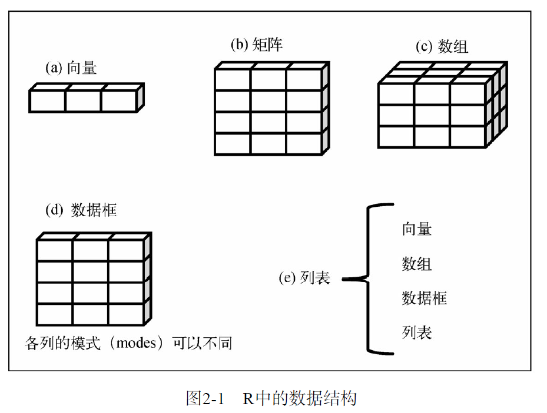

# R语言数据结构
**下标从1开始**
## 向量
    
    ```R
    #相当于一维数组
    #向量中的元素必须有相同的类型或模式，不能混用
    a <- c("one","two","three")
    b <- c(1,2,3)
    c <- c(TRUE, TRUE, FALSE)
    
    #访问
    c[1],c[2],c[3]
    c[c(1,3)]       # c[1],c[3] 括号内的c代表生成一个向量
    c[1:3]          # c[1],c[2],c[3] 切片操作


    ```
## 矩阵
    ```R
    #相当于二维数组，里在的内容必须类型相同
    my_matrix <- matrix(vector, nrow=2, nclo=2, byrow=FALSE, dimnames=list(vector_rownames,vector_colnames))
    #用vector中的数据按列填充一个2X2的矩阵，然后行与列的名字从dimnames中的vector_rownames和vector_colnames获取

    # 访问
    x[i,j]          # 单个元素
    x[i,]           # 一行
    x[,j]           # 一列

    ```
## 数组
    ```R
    # 多维数组，相当于矩阵在多维上的推广
    z <- array(1:24,c(2,3,4),dimnames=(list(dim1,dim2,dim3)))
    # 4个2x3的矩阵, 2x3的矩阵按列来填充，一共填4个

    ```
## 数据框
    ```R
    # 可以包含不同类型的数据，所以使用最多
    # 定义
    mydata<- data.frame(col1,col2,col3);

    # 引用
    mydata$col1   # "$"用来选取数据框中某一列即统计学中的变量

    # 一些相关的函数
    names
    table
    attach
    detach
    with

    #实例标识符

    #因子
    #变量可归结为名义型、有序型或连续型变量
    #名义型： type1 type2
    #有序型： poor improved  excellent
    #连续型：age 14 15 20 30 
    #其中 名义型变量和有序型变量被称为因子
    # 要表示有序型变量，需要为函数factor()指定参数ordered=TRUE levels=c()来指定顺序,默认以字母排序


    ```
## 列表
    ```R
    mylist<-list(obj1,obj2,obj3...)
    一句话：包罗万象

    ```

## 总结



